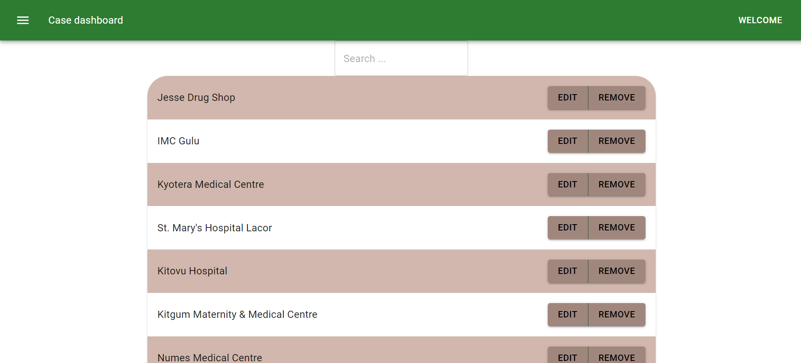

 case-medinsurance


## Description

Th app is a dashborad for the case medinsurance mobile application built for the admin to perform tasks like modifying the hospital list as well as the cities shown on the mobile app.




## Built With

- React
- JavaScript
- Redux

## Deployment
[The site is deployed](https://frosty-beaver-391916.netlify.app)

## Getting Started

To get the content of this project locally you need to run this command in your terminal:

```
- git clone your https://github.com/matovu-farid/case-medinsurance.git
- cd project case-medinsurance
- npm install
- npm start
```


## Authors

👤 **Matovu Farid Nkoba**

- GitHub: [@matovu-farid](https://github.com/matovu-farid)
- Twitter: [@matovu100](https://twitter.com/matovu100)
- LinkedIn: [matovu-farid](https://www.linkedin.com/in/matovu-farid-48b80257)


## 📝 License

This project is [MIT](./MIT.md) licensed.
